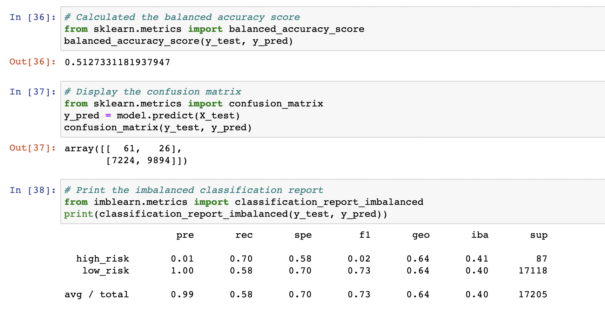

# Credit_Risk_Analysis

## Overview

The purpose of this analysis was to apply machine learning to predict credit risk of an applicant. 

## Results

### Random Oversampling

	The balanced accuracy score is 64%. 
	The "High Risk" precision rate is at 1% with recall at 61% giving this model F1 score of 2%
	"Low Risk" precision rate is at 100% with recall at 68% .

### SMOTE

	The balanced accuracy score is 62%. 
	The "High Risk" precision rate is at 1% with recall at 61% giving this model F1 score of 2%
	"Low Risk" precision rate is at 100% with recall at 64% .

### ClusterCentroids 

	The balanced accuracy score is 62%. 
	The "High Risk" precision rate is at 1% with recall at 57% giving this model F1 score of 1%
	"Low Risk" precision rate is at 100% with much lower recall at 45% .
	

### SMOTEENN

	The balanced accuracy score is 51%. 
	The "High Risk" precision rate is at 1% with recall at 70% giving this model F1 score of 2%
	"Low Risk" precision rate is at 100% with recall at 58% .
	

### BalancedRandomForestClassifier

	The balanced accuracy score is 79%. 
	The "High Risk" precision rate increased to 3% with recall at 70% giving this model F1 score of 6%
	"Low Risk" precision rate is at 100% with recall at 87% .
	

### EasyEnsembleClassifier

	The balanced accuracy score is 93%. 
	The "High Risk" precision rate is at 9% with recall at 92% giving this model F1 score of 16%
	"Low Risk" precision rate is at 100% with recall at 94% .
	

## Summary

EasyEnsembleClassifier showed the best results. It yielded the highest balanced accuracy score, therefore, it has the smallest margin of error compared to other models. It also yielded an accuracy rate of 93.2% and a precision rate of 9% when predicting "High Risk" candidates. The recall (sensitivity) rate was at 92% and the highest among all the models. EasyEnsembleClassifier also yielded the best results for predicting "Low Risk" candidates with the recall rate at 94% and F1 score of 97%. 

If needed, I would recommend using EasyEnsembleClassifier in this type of analysis. 

